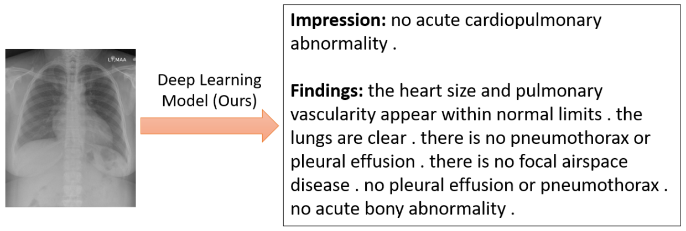

## A Pytorch Implementation: Multimodal Recurrent Model with Attention for Automated Radiology Report Generation

This repository reimplements the *recurrent-conv* model in 2018 MICCAI paper: Multimodal Recurrent Model with Attention for Automated Radiology Report Generation [1].

The source code is licensed under [CC BY 4.0](https://creativecommons.org/licenses/by/4.0/) license. The contents of this repository are released under an [MIT](LICENSE) license.

## Dependencies

The required Python packages are listed in requirements.txt

## Data Download

Download Indiana University Chest X-Ray dataset [2] : [Original source](https://openi.nlm.nih.gov/), it is under the [license](https://creativecommons.org/licenses/by-nc-nd/4.0/). 

I selected all frontal images both with impression and findings: [Download link](https://drive.google.com/file/d/1tXDo9XGSH_uUNYdZt0WaLcTt58bRKMIj/view?usp=sharing) (646 MB), 

After downloading, please unzip it into **"IUdata"** folder.

## Train
#### First, generate .json and .pkl data in "IUdata" folder (I have done it)

#### Second, start train!
- you can train directly, the performance will be **tested** after each epoch.
    ```
    $ python trainer.py
    ```
    
## Test
Before testing, please only keep one set of weights in the **"model_weights"** folder, e.g., 1-finding_decoder-9.ckpt, 1-image_encoder-9.ckpt, 1-impression_decoder-9.ckpt. Only three .ckpt files are allowed in model_weights folder.

Run
    ```
    $ python tester.py
    ```
    
## Results
#### Quantitative Results
|  | BLEU_1 | BLEU_2 | BLEU_3 | BLEU_4 | METEOR | ROUGE |
| :---: | :---: | :---: | :---: | :---: | :---: | :---: |
| OrignalPaper-Recurrent- Conv [1] </sup> |0.416 | 0.298 | 0.217 | **0.163** | **0.227** | 0.309 |
| Ours-Recurrent- Conv </sup> | **0.444** | **0.315** | **0.224** | 0.162 | 0.189 | **0.364** |

#### Qualitative Results



## Citation

If you use codes in this repository, please cite this github website address.

## References
[1] Xue, Y., Xu, T., Long, L.R., Xue, Z., Antani, S., Thoma, G.R., Huang, X.: Multimodal recurrent model with attention for automated radiology report generation. In: International Conference on Medical Image Computing and Computer-Assisted Intervention. pp. 457–466. Springer (2018)

[2] Demner-Fushman, D., Kohli, M.D., Rosenman, M.B., Shooshan, S.E., Rodriguez, L., Antani, S., Thoma, G.R., McDonald, C.J.: Preparing a collection of radiology examinations for distribution and retrieval. J. Am. Med. Inform. Assoc. 23(2), 304–310 (2015)
